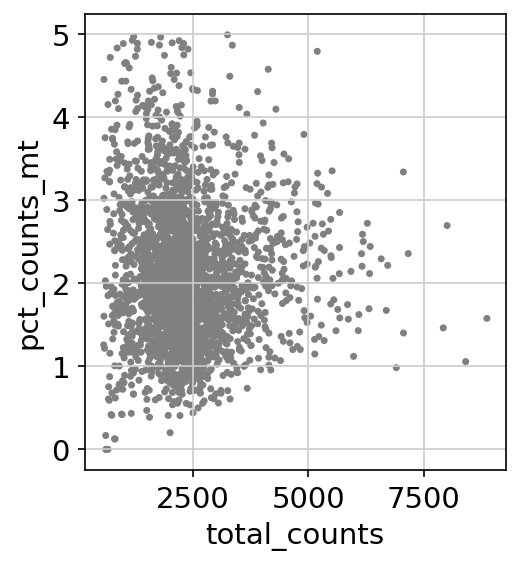

# 🧬 Single-Cell RNA-seq Analysis Pipeline

> End-to-end analysis of **PBMC single-cell RNA sequencing data** — from raw 10X Genomics FASTQ reads through alignment, QC, clustering, and fully annotated cell type identification.


-purple)


---

## 📋 Table of Contents

- [Project Overview](#-project-overview)
- [Dataset](#-dataset)
- [Repository Structure](#-repository-structure)
- [Stage 1 — Galaxy Preprocessing](#1️⃣-stage-1--galaxy-preprocessing)
- [Stage 2 — Scanpy Downstream Analysis](#2️⃣-stage-2--scanpy-downstream-analysis)
- [Stage 3 — AnnData Exploration](#3️⃣-stage-3--anndata-exploration)
- [Key Results & Figures](#-key-results--figures)
- [Cell Type Annotations](#-cell-type-annotations)
- [Data Processing Workflow](#️-data-processing-workflow)
- [Installation & Reproduction](#️-installation--reproduction)
- [Academic Context](#-academic-context)
- [References](#-references)

---

## 🔬 Project Overview

This project documents a **complete, reproducible single-cell RNA sequencing (scRNA-seq) analysis pipeline** applied to peripheral blood mononuclear cells (PBMCs) from a healthy donor. The pipeline spans three interconnected stages:

1. **Galaxy Preprocessing** — raw FASTQ reads are aligned to the human genome using STARsolo, UMIs are quantified per barcode, and real cells are distinguished from empty droplets using DropletUtils
2. **Scanpy Downstream Analysis** — the filtered count matrix undergoes QC, normalization, dimensionality reduction, unsupervised clustering, and marker-gene-based cell type annotation
3. **AnnData Exploration** — the underlying data structure powering the entire scverse ecosystem is examined slot by slot with a hands-on tutorial script

The final output is a fully annotated **UMAP** with **8 biologically validated PBMC cell types**, confirmed through known marker gene expression.

### This repository includes

| Asset | Description |
|---|---|
| 📊 Galaxy Outputs | Raw & filtered count matrices, barcodes, alignment stats |
| 🖼️ Analysis Figures | 8 publication-quality plots from QC through annotation |
| 🐍 Analysis Scripts | Full Scanpy pipeline + AnnData tutorial |
| 📄 Documentation | Step-by-step methodology across all three stages |

---

## 🧫 Dataset

| Property | Details |
|---|---|
| **Sample** | 1k & 3k PBMCs from a Healthy Donor |
| **Full name** | Peripheral Blood Mononuclear Cells |
| **Source** | 10x Genomics — Zenodo record 3457880 & `sc.datasets.pbmc3k()` |
| **Chemistry** | 10X Chromium v3 |
| **Reference genome** | hg19 (GRCh37) |
| **Tools** | Galaxy EU · STARsolo · DropletUtils · MultiQC · Scanpy · AnnData |
| **Environment** | Galaxy EU · Google Colab |
| **Language** | Python 3.12 |
| **Raw cells** | 2,700 |
| **Cells after QC** | **2,638** |
| **HVGs selected** | ~1,838 |
| **Cell clusters** | **8 distinct cell types** |

---

## 🗂️ Repository Structure

```
scrna-seq-analysis/
│
├── 📁 galaxy_preprocessing/              ← Stage 1: Raw FASTQ → Count Matrix
│   ├── outputs/
│   │   ├── matrix_raw_starsolo.mtx       # Raw unfiltered STARsolo count matrix
│   │   ├── matrix_defaultdrops.mtx       # DefaultDrops filtered matrix
│   │   ├── matrix_emptydrops.mtx         # EmptyDrops filtered matrix
│   │   ├── barcodes.tsv                  # Cell barcodes (EmptyDrops)
│   │   ├── barcodes_defaultdrops.tsv     # Cell barcodes (DefaultDrops)
│   │   ├── genes_defaultdrops.tsv        # Gene list (Ensembl ID + symbol)
│   │   ├── starsolo_barcode_stats.txt    # STARsolo barcode & gene statistics
│   │   ├── dropletutils_plot.png         # Barcode rank plot (knee/inflection)
│   │   ├── dropletutils_table.tsv        # DropletUtils per-cell stats
│   │   ├── star_summary_table.tsv        # Alignment summary table
│   │   └── multiqc_general_stats.tsv     # MultiQC compiled statistics
│   ├── workflow/
│   │   └── star_alignment_plot.png       # STAR alignment scores bar chart
│   └── README.md
│
├── 📁 scanpy_analysis/                   ← Stage 2: Clustering & Annotation
│   ├── notebooks/
│   │   └── pbmc3k_analysis.py            # Full Scanpy pipeline script
│   ├── figures/
│   │   ├── 01_qc_violin.png              # QC metrics per cell
│   │   ├── 02_qc_scatter.png             # Total counts vs % mitochondrial
│   │   ├── 03_highly_variable.png        # HVG dispersion plot
│   │   ├── 04_pca_variance.png           # PCA variance ratio (elbow plot)
│   │   ├── 05_umap_markers.png           # UMAP — marker gene expression
│   │   ├── 06_umap_leiden.png            # UMAP — Leiden clusters
│   │   ├── 07_dotplot.png                # Marker gene dotplot
│   │   └── 08_umap_annotated.png         # Final annotated UMAP
│   └── README.md
│
├── 📁 anndata_exploration/               ← Stage 3: AnnData Structure
│   ├── anndata_demo.py                   # Hands-on AnnData tutorial script
│   └── README.md
│
└── README.md                             ← You are here
```

---

## 1️⃣ Stage 1 — Galaxy Preprocessing

**Goal:** Raw FASTQ reads → Clean, filtered count matrix (cells × genes)

Raw paired-end FASTQ files from a 1k PBMC 10X Chromium v3 experiment were uploaded to **Galaxy EU** and processed through a three-tool pipeline.

### Step A — Alignment & Quantification with STARsolo

**Tool:** *RNA STARsolo (v2.7.11a+galaxy1)*

STARsolo simultaneously aligned **R2** reads to *hg19*, matched **R1** barcodes against the 10X whitelist, and counted unique UMIs per gene per valid barcode.

| Parameter | Value |
|---|---|
| Reference genome | Human (*hg19 / GRCh37*) |
| Gene annotation | `Homo_sapiens.GRCh37.75.gtf` |
| Chemistry | Chromium v3 |
| Barcode whitelist | `3M-february-2018.txt.gz` |
| UMI deduplication | CellRanger2-4 algorithm |
| Cell filtering | Disabled — handled by DropletUtils |


> The dominant blue bar confirms the vast majority of reads mapped **uniquely** to the genome — a strong indicator of high-quality library preparation and sequencing.

**Real barcode & gene statistics from `starsolo_barcode_stats.txt`:**

| Metric | Count | Meaning |
|---|---|---|
| `yesWLmatchExact` | **7,530,489** | Reads with exact whitelist barcode match |
| `yesOneWLmatchWithMM` | 19,534 | Reads matched with 1 mismatch |
| `noNoWLmatch` | 50,037 | Reads with no whitelist match (noise) |
| `yesCellBarcodes` | **5,200** | Total cell barcodes detected (pre-filtering) |
| `yesUMIs` | **1,689,978** | Unique UMIs counted |
| `yessubWLmatch_UniqueFeature` | **3,841,347** | Reads contributing to a unique gene count |
| `noNoFeature` | 3,060,392 | Reads mapping to genome but not to any gene |

---

### Step B — Quality Control with MultiQC

**Tool:** *MultiQC (v1.27+galaxy0)*

MultiQC compiled the STARsolo log into an interactive summary report, providing visual inspection of mapping rates, barcode validity, and total UMI distributions across both sequencing lanes (L001 and L002).

---

### Step C — Cell Filtering with DropletUtils

**Tool:** *DropletUtils (v1.10.0+galaxy2)*

Two complementary filtering strategies were applied to remove empty droplets:

#### Method A — DefaultDrops (Cell Ranger equivalent)

| Parameter | Value |
|---|---|
| Expected cells | 3,000 |
| Upper quantile | 0.99 |
| Lower proportion | 0.1 |
| **Cells recovered** | **~272 high-quality cells** |

#### Method B — EmptyDrops (Statistical model)

| Parameter | Value |
|---|---|
| Lower-bound UMI threshold | 200 |
| FDR threshold | 0.01 |
| **Cells recovered** | **~279 high-quality cells** |

> **EmptyDrops recovers more cells** by modelling the ambient RNA distribution statistically rather than applying a hard count threshold — improving resolution for rare cell populations that would otherwise be discarded.

---

## 2️⃣ Stage 2 — Scanpy Downstream Analysis

**Goal:** Filtered count matrix → Biologically annotated cell type clusters

The count matrix was loaded into Python and analyzed using **Scanpy** on Google Colab.

### Step A — Quality Control & Filtering

Three QC metrics were assessed per cell to remove low-quality observations:


| Filter | Threshold | Removes |
|---|---|---|
| Minimum genes per cell | > 200 | Empty droplets |
| Maximum genes per cell | < 2,500 | Likely doublets |
| Mitochondrial read % | < 5% | Dying / stressed cells |

> **Why mitochondrial reads?** When a cell dies, cytoplasmic mRNA leaks out while mitochondrial RNA — enclosed inside mitochondria — is retained. A high % of mitochondrial reads therefore reliably flags low-quality or apoptotic cells.



**Result:** 2,700 → **2,638 cells** retained after filtering.

---

### Step B — Normalization & Log Transformation

```python
sc.pp.normalize_total(adata, target_sum=1e4)   # scale each cell to 10,000 counts
sc.pp.log1p(adata)                              # log(x+1) transform
```

Library-size normalization makes cells comparable regardless of sequencing depth. The log transform compresses the dynamic range and stabilizes variance across genes.

---

### Step C — Highly Variable Gene Selection


```python
sc.pp.highly_variable_genes(adata, min_mean=0.0125, max_mean=3, min_disp=0.5)
```

Genes were ranked by normalized dispersion vs. mean expression. Black dots = HVGs selected for downstream analysis. This reduced the feature space from **32,738 → ~1,838 genes** while retaining the genes that vary most meaningfully across cell types.

---

### Step D — Regression, Scaling & PCA

```python
sc.pp.regress_out(adata, ['total_counts', 'pct_counts_mt'])  # remove technical variation
sc.pp.scale(adata, max_value=10)                              # zero mean, unit variance
sc.tl.pca(adata, svd_solver='arpack')                        # 40 principal components
```


> The elbow in the variance ratio plot around PC 10–15 confirms that 40 PCs capture the majority of biologically meaningful variance without retaining noise.

---

### Step E — UMAP & Leiden Clustering

```python
sc.pp.neighbors(adata, n_neighbors=10, n_pcs=40)   # KNN graph
sc.tl.umap(adata)                                   # 2D embedding
sc.tl.leiden(
    adata,
    resolution=0.9,
    random_state=0,
    flavor="igraph",
    n_iterations=2,
    directed=False,
)
```

**Marker gene expression overlaid on UMAP — before formal clustering:**


| Marker | Expression Pattern | Cell Type Hinted |
|---|---|---|
| **CST3** | High in left cluster | Monocytes / Dendritic cells |
| **NKG7** | High in bottom-right | NK cells / CD8 T cells |
| **PPBP** | Isolated island (bottom-right) | Platelets |

**Leiden clusters at resolution 0.9:**


**Result:** **8 distinct, well-separated clusters** identified.

---

### Step F — Marker Gene Identification & Cell Type Annotation

Differentially expressed genes were identified per cluster using the **Wilcoxon rank-sum test**:

```python
sc.tl.rank_genes_groups(adata, 'leiden', method='wilcoxon')
```


> **Reading the dotplot:** Dot size = fraction of cells in the cluster expressing the gene. Color intensity = mean expression level. Clean, cluster-specific patterns here confirm biologically distinct populations.

Each cluster was then mapped to a known PBMC cell type based on canonical marker genes:

```python
cell_type_map = {
    '0': 'CD4 T cells',      '1': 'CD14 Monocytes',
    '2': 'B cells',           '3': 'CD8 T cells',
    '4': 'NK cells',          '5': 'CD14 Monocytes',
    '6': 'Dendritic cells',   '7': 'FCGR3A Monocytes',
}
adata.obs['cell_type'] = adata.obs['leiden'].map(cell_type_map)
```

**Final annotated UMAP:**


---

## 3️⃣ Stage 3 — AnnData Exploration

**Goal:** Understand how AnnData organizes all scRNA-seq data in a single structured object

AnnData is the unified data container of the scverse ecosystem — used by Scanpy, scVI, CellRank, Squidpy, and more. After the full pipeline, the PBMC object contained:

```
AnnData object  ── 2638 obs × 1838 vars
│
├── .X          →  Scaled, normalized expression matrix  (HVGs only)
├── .raw        →  Pre-HVG log-normalized counts         (frozen)
├── .obs        →  n_genes_by_counts · pct_counts_mt · leiden · cell_type
├── .var        →  mt flag · highly_variable · means · dispersions
├── .obsm       →  X_pca (2638 × 40)  ·  X_umap (2638 × 2)
├── .obsp       →  KNN connectivities + distances
└── .uns        →  leiden_colors · rank_genes_groups · neighbors params
```

See [`anndata_exploration/README.md`](anndata_exploration/README.md) and `anndata_demo.py` for a full slot-by-slot reference and hands-on tutorial.

---

## 📊 Key Results & Figures

| # | Figure | What It Shows |
|---|---|---|
| 1 |  **QC Violin** | Distribution of genes per cell, total counts, and % mitochondrial reads before filtering |
| 2 |  **QC Scatter** | Total counts vs % mitochondrial reads — visualizing the 5% MT cutoff |
| 3 |  **HVG Plot** | Normalized dispersion vs mean expression — black dots are selected HVGs |
| 4 |  **PCA Variance** | Elbow plot confirming 40 PCs capture the majority of variance |
| 5 |  **UMAP Markers** | CST3, NKG7, PPBP expression revealing cell structure before clustering |
| 6 |  **UMAP Leiden** | 8 Leiden clusters at resolution 0.9 |
| 7 |  **Dotplot** | Marker gene specificity per cluster (size = % expressing, color = mean expr) |
| 8 |  **Annotated UMAP** | Final UMAP with biological cell type labels |

---

## 🧫 Cell Type Annotations

| Cluster | Cell Type | Key Markers | Biology |
|---|---|---|---|
| 0 | CD4 T cells | *IL7R, CCR7* | Helper T cells — orchestrate adaptive immune responses |
| 1 | CD14 Monocytes | *LYZ, CD14* | Classical monocytes — phagocytosis & cytokine production |
| 2 | B cells | *CD79A, MS4A1* | Antibody-producing lymphocytes |
| 3 | CD8 T cells | *CD8A, CD8B* | Cytotoxic T cells — kill virally infected cells |
| 4 | NK cells | *GNLY, NKG7* | Natural killer cells — innate cytotoxicity without prior sensitization |
| 5 | CD14 Monocytes | *S100A8, LGALS3* | Inflammatory monocyte subpopulation |
| 6 | Dendritic cells | *FCER1A, CST3* | Professional antigen-presenting cells |
| 7 | FCGR3A Monocytes | *FCGR3A, MS4A7* | Non-classical patrolling monocytes |

---

## ⚙️ Data Processing Workflow

```
1.  Data Upload          →  4 FASTQ files (2 lanes × R1/R2) uploaded to Galaxy EU
2.  Alignment            →  STARsolo aligns R2 to hg19; counts UMIs per barcode
3.  QC Assessment        →  MultiQC inspects mapping rates & barcode statistics
4.  Cell Filtering       →  DropletUtils (DefaultDrops + EmptyDrops) removes empty droplets
5.  Matrix Export        →  matrix.mtx + barcodes.tsv + genes.tsv downloaded
6.  Scanpy QC            →  Low-quality cells & rare genes removed
7.  Normalization        →  Library-size normalization + log1p transform
8.  Feature Selection    →  ~1,838 highly variable genes selected
9.  Dimensionality       →  Regress out confounders → Scale → PCA (40 PCs)
10. Clustering           →  KNN graph → Leiden algorithm (resolution 0.9)
11. Visualization        →  UMAP 2D projection
12. Marker Genes         →  Wilcoxon rank-sum test per cluster
13. Annotation           →  Clusters mapped to known PBMC cell types
14. Export               →  Final AnnData saved as pbmc3k.h5ad
```

---

## ⚙️ Installation & Reproduction

### Install Dependencies

```bash
# Core analysis stack
pip install scanpy anndata matplotlib seaborn pandas numpy scipy

# Clustering backend
pip install python-igraph leidenalg
```

### Run the Analysis

```bash
# Clone the repository
git clone https://github.com/fafzal31/scRNA
cd scrna-seq-analysis

# Run the full Scanpy pipeline
python scanpy_analysis/notebooks/pbmc3k_analysis.py

# Run the AnnData tutorial
python anndata_exploration/anndata_demo.py
```

### Quick Start Snippet

```python
import scanpy as sc

adata = sc.datasets.pbmc3k()
adata.var_names_make_unique()

# QC
sc.pp.filter_cells(adata, min_genes=200)
sc.pp.filter_genes(adata, min_cells=3)
adata.var['mt'] = adata.var_names.str.startswith('MT-')
sc.pp.calculate_qc_metrics(adata, qc_vars=['mt'], inplace=True)
adata = adata[adata.obs.n_genes_by_counts < 2500]
adata = adata[adata.obs.pct_counts_mt < 5]

# See scanpy_analysis/notebooks/pbmc3k_analysis.py for the full pipeline
```

---

## 🎓 Academic Context

This project models a real-world bioinformatics workflow in which raw sequencing data is preprocessed, quality-controlled, clustered, and biologically interpreted. It reflects core competencies in:

- **Single-Cell Genomics** — understanding droplet-based scRNA-seq library preparation and the UMI counting model
- **Read Alignment** — using STARsolo for barcode-aware, splice-aware genome alignment
- **Quality Control** — identifying and removing low-quality cells using per-cell QC metrics
- **Dimensionality Reduction** — applying PCA and UMAP to high-dimensional gene expression data
- **Unsupervised Clustering** — using the Leiden algorithm to detect communities in cell similarity graphs
- **Marker Gene Analysis** — statistical identification of cluster-defining genes using Wilcoxon rank-sum tests
- **Cell Type Annotation** — mapping clusters to known biology using canonical PBMC marker genes
- **Data Structures** — working with the AnnData format central to the scverse ecosystem

---

## 📖 References

- [Galaxy Training — Pre-processing of 10X Single-Cell RNA Datasets](https://training.galaxyproject.org/training-material/topics/single-cell/tutorials/scrna-preprocessing-tenx/tutorial.html)
- [Scanpy PBMC3k Tutorial](https://scanpy.readthedocs.io/en/latest/tutorials/basics/clustering-2017.html)
- [AnnData Documentation](https://anndata.readthedocs.io)
- [Zenodo Dataset Record 3457880](https://zenodo.org/record/3457880)
- *Wolf et al. (2018)* — Scanpy: large-scale single-cell gene expression data analysis. **Genome Biology**
- *Tekman et al. (2020)* — A single-cell RNA-sequencing training and analysis suite using the Galaxy framework. **GigaScience**
- *Satija et al. (2015)* — Spatial reconstruction of single-cell gene expression data. **Nature Biotechnology**
- *Virshup et al. (2021)* — The scverse project provides a computational ecosystem for single-cell omics data analysis. **Nature Biotechnology**

---

<div align="center">

*Bioinformatics Assignment · Single-Cell RNA-seq Analysis · April 2026*

</div>