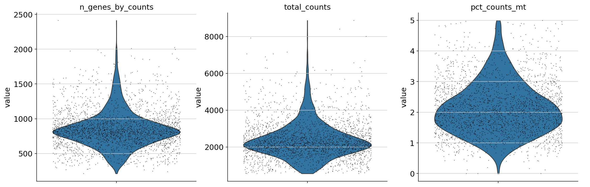
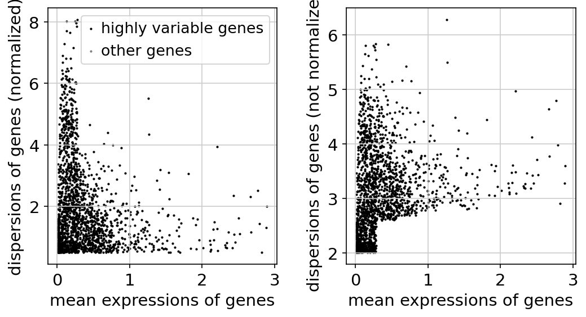
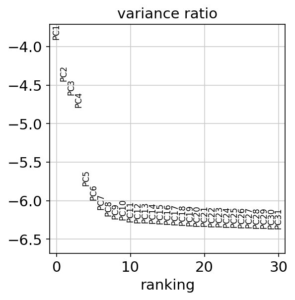
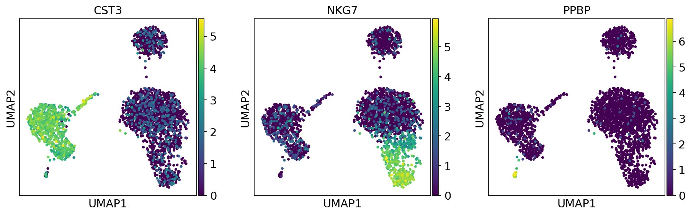
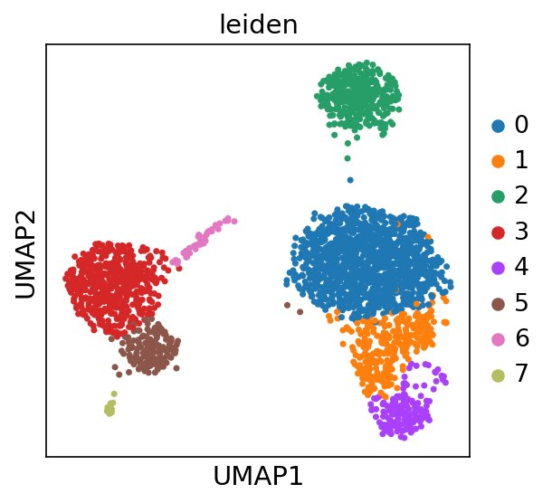
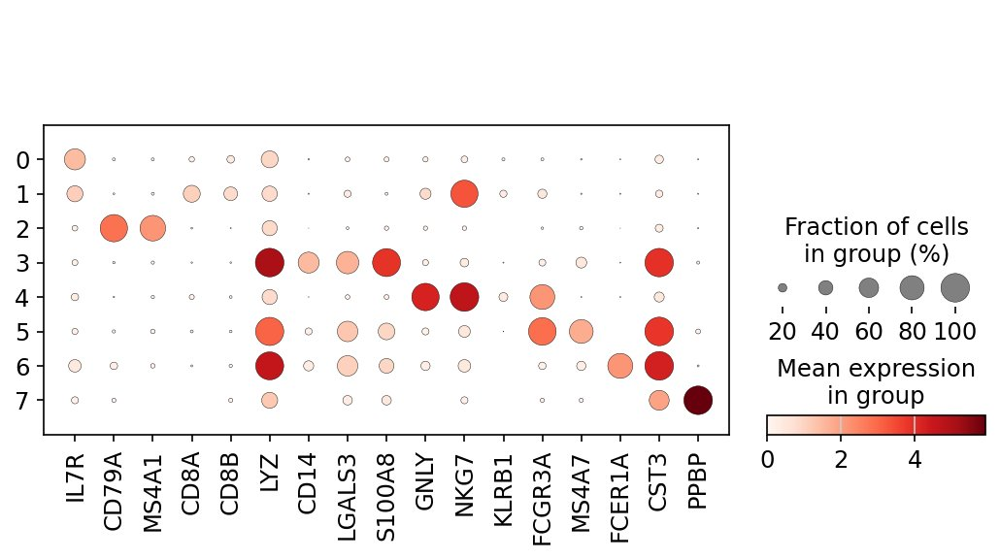
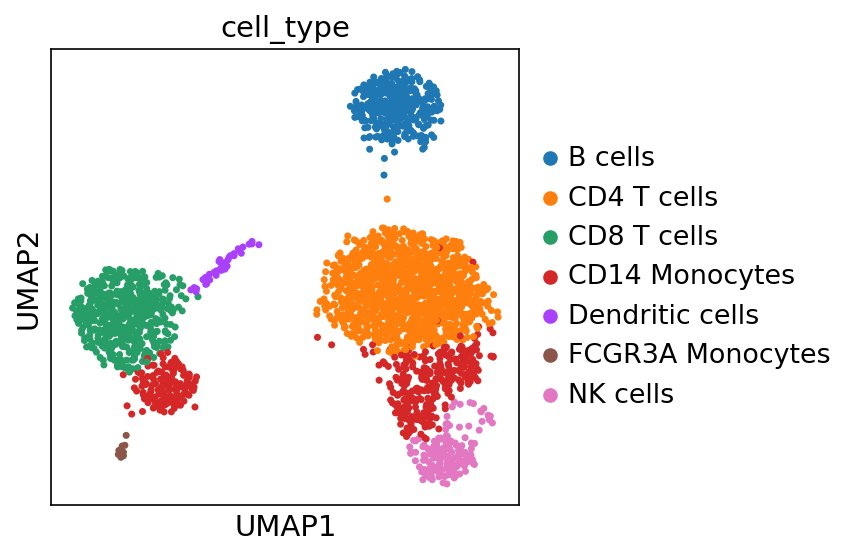

# 🧬 Single-Cell RNA-seq Analysis Pipeline
### From Raw FASTQ Reads → Annotated Cell Type Clusters

> A complete, end-to-end single-cell RNA sequencing (scRNA-seq) analysis project — spanning raw 10X Genomics preprocessing in **Galaxy**, downstream clustering with **Scanpy**, and data structure exploration with **AnnData**.

---

<div align="center">


</div>

---

## 📌 Project Summary

| Property | Details |
|---|---|
| **Dataset** | 1k & 3k PBMCs from a Healthy Donor |
| **Full name** | Peripheral Blood Mononuclear Cells |
| **Source** | 10x Genomics (via Zenodo & `sc.datasets.pbmc3k()`) |
| **Tools** | Galaxy EU · STARsolo · DropletUtils · MultiQC · Scanpy · AnnData |
| **Environment** | Galaxy EU · Google Colab |
| **Language** | Python 3.12 |
| **Cells recovered** | **2,638** (after QC filtering) |
| **Cell clusters** | **8 distinct cell types** identified |

---

## 🗂️ Repository Structure

```
scrna-seq-analysis/
│
├── 📁 galaxy_preprocessing/        ← Section 1: Raw FASTQ → Count Matrix
│   ├── outputs/
│   │   ├── matrix_raw_starsolo.mtx       # Raw STARsolo count matrix (unfiltered)
│   │   ├── matrix_defaultdrops.mtx       # DefaultDrops filtered matrix
│   │   ├── matrix_emptydrops.mtx         # EmptyDrops filtered matrix
│   │   ├── barcodes.tsv                  # Cell barcodes (EmptyDrops)
│   │   ├── barcodes_defaultdrops.tsv     # Cell barcodes (DefaultDrops)
│   │   ├── genes_defaultdrops.tsv        # Gene list (Ensembl ID + symbol)
│   │   ├── starsolo_barcode_stats.txt    # Barcode & gene statistic summaries
│   │   ├── dropletutils_plot.png         # Barcode rank plot
│   │   ├── dropletutils_table.tsv        # DropletUtils cell stats
│   │   ├── star_summary_table.tsv        # Alignment summary
│   │   └── multiqc_general_stats.tsv     # MultiQC statistics
│   ├── workflow/
│   │   └── star_alignment_plot.png
│   └── README.md
│
├── 📁 scanpy_analysis/             ← Section 2: Clustering & Cell Type Annotation
│   ├── notebooks/
│   │   └── pbmc3k_analysis.py      # Full analysis pipeline script
│   ├── figures/
│   │   ├── 01_qc_violin.png
│   │   ├── 02_qc_scatter.png
│   │   ├── 03_highly_variable.png
│   │   ├── 04_pca_variance.png
│   │   ├── 05_umap_markers.png
│   │   ├── 06_umap_leiden.png
│   │   ├── 07_dotplot.png
│   │   └── 08_umap_annotated.png
│   └── README.md
│
├── 📁 anndata_exploration/         ← Section 3: AnnData Structure & Exploration
│   ├── anndata_demo.py             # Hands-on AnnData tutorial script
│   └── README.md
│
└── README.md                       ← You are here
```

---

## 🔬 Pipeline Overview

This project covers **three interconnected stages** of a modern scRNA-seq analysis:

```
  ┌─────────────────────────────────────────────────────────────────┐
  │  STAGE 1 — Galaxy Preprocessing                                 │
  │                                                                 │
  │  Raw FASTQ files (4 files, 2 lanes)                             │
  │       │                                                         │
  │       ▼                                                         │
  │  RNA STARsolo  ──► Align to hg19 + count UMIs per barcode      │
  │       │                                                         │
  │       ▼                                                         │
  │  MultiQC       ──► QC report (mapping rates, barcode stats)     │
  │       │                                                         │
  │       ▼                                                         │
  │  DropletUtils  ──► Filter real cells from empty droplets        │
  │       │                                                         │
  │       ▼                                                         │
  │  matrix.mtx + barcodes.tsv + features.tsv                       │
  └─────────────────────────────────────────────────────────────────┘
                              │
                              ▼
  ┌─────────────────────────────────────────────────────────────────┐
  │  STAGE 2 — Scanpy Downstream Analysis                           │
  │                                                                 │
  │  Count matrix (AnnData object)                                  │
  │       │                                                         │
  │       ▼                                                         │
  │  QC Filter → Normalize → Log1p → HVG selection                  │
  │       │                                                         │
  │       ▼                                                         │
  │  Regress out confounders → Scale → PCA (40 PCs)                 │
  │       │                                                         │
  │       ▼                                                         │
  │  KNN graph → Leiden clustering → UMAP                           │
  │       │                                                         │
  │       ▼                                                         │
  │  Wilcoxon marker genes → Cell type annotation                   │
  └─────────────────────────────────────────────────────────────────┘
                              │
                              ▼
  ┌─────────────────────────────────────────────────────────────────┐
  │  STAGE 3 — AnnData Exploration                                  │
  │                                                                 │
  │  Understanding the AnnData object structure:                    │
  │  .X  .obs  .var  .obsm  .obsp  .layers  .uns                   │
  └─────────────────────────────────────────────────────────────────┘
```

---

## 📊 Key Results

### STAR Alignment Quality

The STARsolo alignment of 1k PBMC FASTQ reads against *hg19* produced high-quality results:


> The vast majority of reads mapped **uniquely** to the genome — a strong indicator of high-quality library preparation and sequencing.

---

### QC Metrics — Before Filtering

Three QC metrics were assessed per cell to identify and remove low-quality cells:



| Metric | What it measures | Threshold applied |
|---|---|---|
| `n_genes_by_counts` | Genes detected per cell | 200 – 2,500 |
| `total_counts` | Total UMIs per cell | No hard cutoff |
| `pct_counts_mt` | % mitochondrial reads | < 5% |

---

### Highly Variable Gene Selection

Genes were ranked by normalized dispersion vs. mean expression. Black dots = HVGs selected for downstream analysis.



---

### PCA Variance Ratio

The elbow plot confirms the first 10–15 PCs capture the most biological variance, justifying the use of 40 PCs for the neighbor graph.



---

### UMAP — Marker Gene Expression

Expression of key lineage markers overlaid on the UMAP reveals biologically meaningful structure even before formal clustering:



- **CST3** → Monocytes (left cluster)
- **NKG7** → NK cells / CD8 T cells (bottom right)
- **PPBP** → Platelets (bottom right, isolated)

---

### UMAP — Leiden Clusters

The Leiden algorithm (resolution = 0.9) identified **8 distinct clusters**:



---

### Marker Gene Dotplot

Dot size = fraction of cells expressing the gene. Color intensity = mean expression level.



This dotplot confirms clean, cluster-specific marker gene expression — validating the biological accuracy of the clustering.

---

### Final Annotated UMAP

After mapping Leiden clusters to known PBMC cell types using established marker genes:



---

## 🧫 Cell Type Annotations

| Cluster | **Cell Type** | *Key Markers* | Biology |
|---|---|---|---|
| 0 | CD4 T cells | *IL7R, CCR7* | Helper T cells — coordinate adaptive immunity |
| 1 | CD14 Monocytes | *LYZ, CD14* | Innate immune cells — phagocytosis |
| 2 | B cells | *CD79A, MS4A1* | Antibody-producing lymphocytes |
| 3 | CD8 T cells | *CD8A, CD8B* | Cytotoxic T cells — kill infected cells |
| 4 | NK cells | *GNLY, NKG7* | Natural killer cells — innate cytotoxicity |
| 5 | CD14 Monocytes | *S100A8, LGALS3* | Inflammatory monocytes |
| 6 | Dendritic cells | *FCER1A, CST3* | Antigen-presenting cells |
| 7 | FCGR3A Monocytes | *FCGR3A, MS4A7* | Patrolling monocytes |

---

## ⚙️ Installation & Reproduction

### Dependencies

```bash
# Core analysis
pip install scanpy anndata matplotlib seaborn pandas numpy scipy

# Clustering
pip install python-igraph leidenalg
```

### Quick Start

```python
import scanpy as sc

# Load PBMC 3k dataset
adata = sc.datasets.pbmc3k()
adata.var_names_make_unique()

# QC filtering
sc.pp.filter_cells(adata, min_genes=200)
sc.pp.filter_genes(adata, min_cells=3)
adata.var['mt'] = adata.var_names.str.startswith('MT-')
sc.pp.calculate_qc_metrics(adata, qc_vars=['mt'], inplace=True)
adata = adata[adata.obs.n_genes_by_counts < 2500]
adata = adata[adata.obs.pct_counts_mt < 5]

# Full pipeline in notebooks/pbmc3k_analysis.py
```

---

## 📖 References

- [Galaxy Training — Pre-processing of 10X Single-Cell RNA Datasets](https://training.galaxyproject.org/training-material/topics/single-cell/tutorials/scrna-preprocessing-tenx/tutorial.html)
- [Scanpy PBMC3k Tutorial](https://scanpy.readthedocs.io/en/latest/tutorials/basics/clustering-2017.html)
- [AnnData Documentation](https://anndata.readthedocs.io)
- [Zenodo Dataset Record 3457880](https://zenodo.org/record/3457880)
- *Wolf et al. (2018)* — Scanpy: large-scale single-cell gene expression data analysis. **Genome Biology**
- *Tekman et al. (2020)* — A single-cell RNA-sequencing training and analysis suite using the Galaxy framework. **GigaScience**
- *Satija et al. (2015)* — Spatial reconstruction of single-cell gene expression data. **Nature Biotechnology**

---

<div align="center">

*Bioinformatics Assignment · Single-Cell RNA-seq Analysis · April 2026*

</div>
