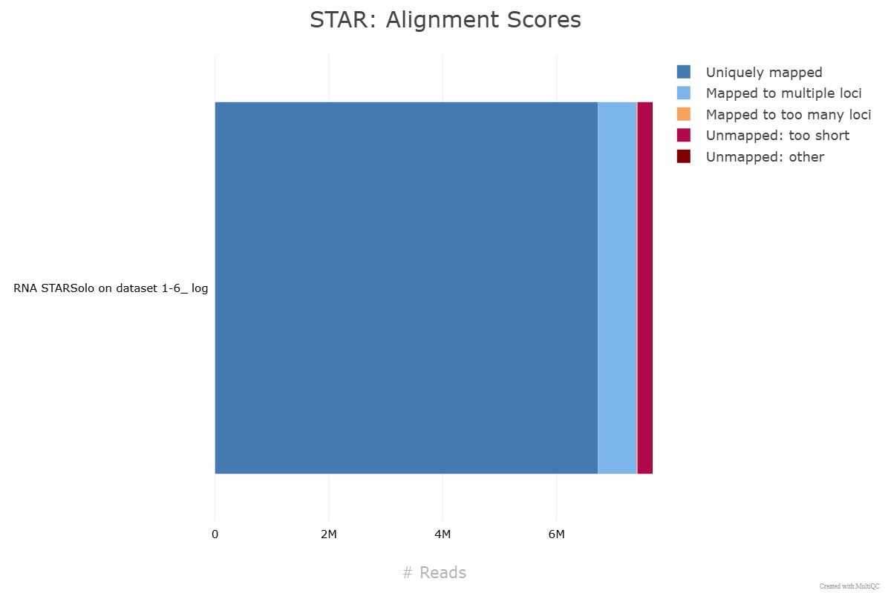

# 🔬 Galaxy 10X Preprocessing
### Raw FASTQ → Filtered Gene Expression Count Matrix

> Converting millions of raw sequencing reads into a structured, analysis-ready count matrix using **STARsolo**, **MultiQC**, and **DropletUtils** on the Galaxy platform.

---

## Goal

**Raw FASTQ reads → Clean, filtered count matrix (cells × genes)**

---

## 📁 Folder Contents

```
galaxy_preprocessing/
│
├── outputs/
│   ├── matrix_raw_starsolo.mtx     # Raw count matrix — STARsolo output (unfiltered)
│   ├── matrix_defaultdrops.mtx     # Count matrix — DefaultDrops filtered
│   ├── matrix_emptydrops.mtx       # Count matrix — EmptyDrops filtered
│   ├── barcodes.tsv                # Cell barcodes (EmptyDrops)
│   ├── barcodes_defaultdrops.tsv   # Cell barcodes (DefaultDrops)
│   ├── genes_defaultdrops.tsv      # Gene list (Ensembl ID + symbol)
│   ├── starsolo_barcode_stats.txt  # STARsolo barcode & gene statistic summaries
│   ├── dropletutils_plot.png       # Barcode rank plot (knee/inflection)
│   ├── dropletutils_table.tsv      # DropletUtils cell stats
│   ├── star_summary_table.tsv      # STARsolo alignment summary
│   └── multiqc_general_stats.tsv   # MultiQC general statistics
│
├── workflow/
│   └── star_alignment_plot.png     # STAR alignment scores bar chart
│
└── README.md
```

---

## 🧬 Dataset

| Property | Details |
|---|---|
| **Sample** | 1k PBMCs from a Healthy Donor |
| **Full name** | Peripheral Blood Mononuclear Cells |
| **Source** | 10x Genomics (Zenodo record 3457880) |
| **Chemistry** | 10X Chromium **v3** |
| **Reference genome** | *hg19 (GRCh37)* |
| **Input** | 4 FASTQ files across 2 sequencing lanes (L001, L002) |

---

## 🧪 Understanding 10X Chromium Input Files

The 10X Chromium v3 system generates two read types per lane:

| File | Read | Contains | Length |
|---|---|---|---|
| `R1` | Read 1 | **Cell Barcode** (16 bp) + **UMI** (12 bp) | 28 bp |
| `R2` | Read 2 | cDNA sequence (actual gene read) | 91 bp |
| `I1` | Index | Sample index (not needed for STARsolo) | 8 bp |

> **Cell Barcode** — identifies *which cell* a read came from  
> **UMI** — tags each RNA molecule before PCR to remove duplicates  
> **Whitelist** — ~3.7M known valid 10X barcodes used for barcode correction

---

## Workflow Steps

### Step 1 — Data Upload & Organization

Uploaded to Galaxy EU and organized into a dataset collection:

```
subset_pbmc_1k_v3_S1_L001_R1_001.fastq.gz   ← Barcode + UMI (Lane 1)
subset_pbmc_1k_v3_S1_L001_R2_001.fastq.gz   ← cDNA read (Lane 1)
subset_pbmc_1k_v3_S1_L002_R1_001.fastq.gz   ← Barcode + UMI (Lane 2)
subset_pbmc_1k_v3_S1_L002_R2_001.fastq.gz   ← cDNA read (Lane 2)
Homo_sapiens.GRCh37.75.gtf                  ← Gene annotation
3M-february-2018.txt.gz                     ← 10X barcode whitelist
```

---

### Step 2 — Alignment & Quantification with STARsolo

**Tool:** *RNA STARsolo (Galaxy version 2.7.11a+galaxy1)*

STARsolo simultaneously aligns cDNA reads to the genome, matches barcodes to the whitelist, and counts unique UMIs per gene per cell.

| Parameter | Value |
|---|---|
| Reference genome | Human (*hg19*) |
| Gene annotation | `Homo_sapiens.GRCh37.75.gtf` |
| Chemistry | Chromium v3 |
| Barcode whitelist | `3M-february-2018.txt.gz` |
| UMI deduplication | CellRanger2-4 algorithm |
| Cell filtering | Disabled (handled by DropletUtils) |

**Output files:** `matrix.mtx`, `barcodes.tsv`, `genes.tsv`, alignment log, BAM file

---

### Step 3 — Quality Control with MultiQC

**Tool:** *MultiQC (Galaxy version 1.27+galaxy0)*



Key metrics from the actual STARsolo barcode/gene statistic summaries (`starsolo_barcode_stats.txt`):

**Barcode Statistics:**

| Metric | Count | Meaning |
|---|---|---|
| `yesWLmatchExact` | **7,530,489** | Reads with exact whitelist barcode match |
| `yesOneWLmatchWithMM` | 19,534 | Reads matched with 1 mismatch |
| `yesMultWLmatchWithMM` | 84,800 | Reads with multiple whitelist matches |
| `noNoWLmatch` | 50,037 | Reads with no whitelist match (noise) |
| `noUMIhomopolymer` | 707 | Reads filtered — homopolymer UMI |

**Gene Statistics:**

| Metric | Count | Meaning |
|---|---|---|
| `yesCellBarcodes` | **5,200** | Total cell barcodes detected (before filtering) |
| `yesUMIs` | **1,689,978** | Unique UMIs counted |
| `yessubWLmatch_UniqueFeature` | **3,841,347** | Reads contributing to a unique gene count |
| `noNoFeature` | 3,060,392 | Reads mapping to genome but not to any gene |
| `noUnmapped` | 278,029 | Unmapped reads |

---

### Step 4 — Cell Filtering with DropletUtils

**Tool:** *DropletUtils (Galaxy version 1.10.0+galaxy2)*

Two complementary methods were applied:

#### Method A — DefaultDrops (Cell Ranger equivalent)

Mimics the Cell Ranger algorithm by identifying cells above an adaptive threshold derived from the top expected cells.

| Parameter | Value |
|---|---|
| Expected cells | 3,000 |
| Upper quantile | 0.99 |
| Lower proportion | 0.1 |
| **Cells recovered** | **~272 high-quality cells** |

#### Method B — EmptyDrops (Statistical model)

Uses a statistical test to distinguish real cells from ambient RNA, even at lower UMI counts — recovering more cells without sacrificing quality.

| Parameter | Value |
|---|---|
| Lower-bound UMI threshold | 200 |
| FDR threshold | 0.01 |
| **Cells recovered** | **~279 high-quality cells** |

> **EmptyDrops recovers more cells** because it models the ambient RNA distribution statistically rather than applying a hard threshold — improving resolution for rare cell populations.

---

### Step 5 — Output Export

Downloaded the final 3-file MTX bundle from Galaxy history for use in Scanpy:

```
matrix.mtx    →  Sparse count matrix (genes × cells)
barcodes.tsv  →  One valid cell barcode per line
features.tsv  →  Ensembl gene ID + gene symbol per row
```

---

## 📤 Key Outputs

| File | Format | Description |
|---|---|---|
| `matrix_raw_starsolo.mtx` | MTX | Raw unfiltered count matrix from STARsolo |
| `matrix_defaultdrops.mtx` | MTX | Filtered count matrix — DefaultDrops |
| `matrix_emptydrops.mtx` | MTX | Filtered count matrix — EmptyDrops |
| `barcodes.tsv` | TSV | Valid cell barcodes (EmptyDrops) |
| `barcodes_defaultdrops.tsv` | TSV | Valid cell barcodes (DefaultDrops) |
| `genes_defaultdrops.tsv` | TSV | Gene list (Ensembl ID + symbol) |
| `starsolo_barcode_stats.txt` | TXT | Full STARsolo barcode & gene statistics |
| `dropletutils_plot.png` | PNG | Barcode rank plot — knee & inflection thresholds |
| `star_summary_table.tsv` | TSV | STARsolo alignment metrics |
| `multiqc_general_stats.tsv` | TSV | MultiQC compiled statistics |

---

## 💡 Why Sparse MTX Format?

A scRNA-seq count matrix for 3,000 cells × 33,000 genes would contain ~100 million entries — the vast majority of which are **zero** (most genes are not expressed in any given cell). The **MTX (Market Exchange) sparse format** stores only the non-zero values, reducing file size by 90%+ while remaining compatible with all standard analysis tools.

---

## 🔗 References

- [Galaxy Training — Pre-processing of 10X Single-Cell RNA Datasets](https://training.galaxyproject.org/training-material/topics/single-cell/tutorials/scrna-preprocessing-tenx/tutorial.html)
- [Zenodo Dataset 3457880](https://zenodo.org/record/3457880)
- *Tekman et al. (2020)* — A single-cell RNA-sequencing training and analysis suite using the Galaxy framework. **GigaScience**
